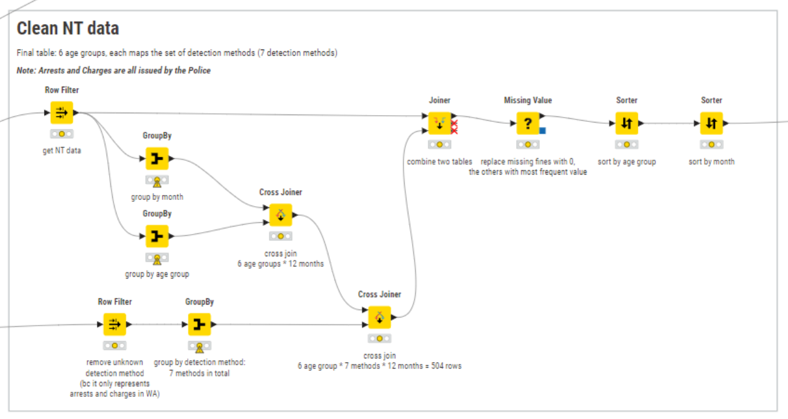

# Speeding Fines Australia (2023) 🚗📊  
[](../../branches)  
[](LICENSE)  
[](https://d3js.org/)

> **An interactive web dashboard visualizing speeding fine statistics across Australian states in 2023. Built with D3.js, hosted on AWS S3, and powered by KNIME for data preprocessing.**

---

## 📊 Project Overview

This dashboard explores when, where, and how Australians were fined for speeding during 2023. It aims to help users:

- Understand monthly and regional variations in fine counts
- Compare detection methods (e.g., camera vs police-issued)
- Explore demographics such as age group distributions
- Visualize jurisdictional enforcement through charts and maps

The data was sourced from the Australian Government and processed in KNIME to produce clean, standardized CSV and JSON files for D3.js visualizations.

---

## 🌐 Live Dashboard

▶ **[View the live dashboard](https://web-dashboard-speeding-fines-2023-australia.s3.ap-southeast-2.amazonaws.com/index.html)**  
> Hosted using Amazon S3. No backend or build step required.

---

## 🖼️ Dashboard Screenshots

### Home Page – Project Introduction
<p align="center">
  
</p>

### Monthly Trends & Detection Methods
<p align="center">
  
</p>

### Age Group & Jurisdiction Breakdown
<p align="center">
  
</p>

---

## 🧼 KNIME Workflows – Data Cleaning & Transformation

The dataset required jurisdiction-specific cleaning due to inconsistencies in format and missing values. KNIME was used to clean, aggregate, and join the data across age groups, months, and detection methods.

### QLD Workflow
<p align="center">
  
</p>

### ACT Workflow
<p align="center">
  
</p>

### NSW Workflow
<p align="center">
  
</p>

### NT Workflow
<p align="center">
  
</p>

### SA Workflow
<p align="center">
  
</p>

### TAS Workflow
<p align="center">
  
</p>

### VIC Workflow
<p align="center">
  
</p>

### WA Workflow
<p align="center">
  
</p>

### Final Output Pipeline – Exporting Cleaned Files
<p align="center">
  
</p>

---

## 🛠️ Tech Stack

| Layer           | Tools & Technologies                              |
|------------------|----------------------------------------------------|
| Front-End        | HTML5, CSS3, JavaScript                           |
| Visualizations   | D3.js v7                                           |
| Hosting          | Amazon S3 (static website)                        |
| ETL & Cleaning   | KNIME Analytics Platform                          |
| Data Source      | [BITRE Enforcement Data, 2024](https://www.bitre.gov.au/publications/2024/road-safety-enforcement-data) |

---

## 📁 Repository Structure

| Folder / File         | Description                                     |
|------------------------|-------------------------------------------------|
| `index.html`           | Main entry page                                 |
| `css/`                 | Layout and visual styling                       |
| `js/`                  | D3.js chart logic and data handlers             |
| `data/`                | Preprocessed CSV/JSON files                     |
| `images/`              | Dashboard screenshots and KNIME workflows       |
| `.vscode/`             | Optional VS Code settings                       |

---

## 🧑‍💻 Running Locally

```bash
# Clone this repository
git clone https://github.com/melvin0108/Web-Dashboard-Speeding-Fines-2023-Australia.git

# Navigate into the project directory
cd Web-Dashboard-Speeding-Fines-2023-Australia

# Open with VS Code
code .

# Launch index.html using Live Server
# (Right-click → 'Open with Live Server' OR run from extensions panel)
